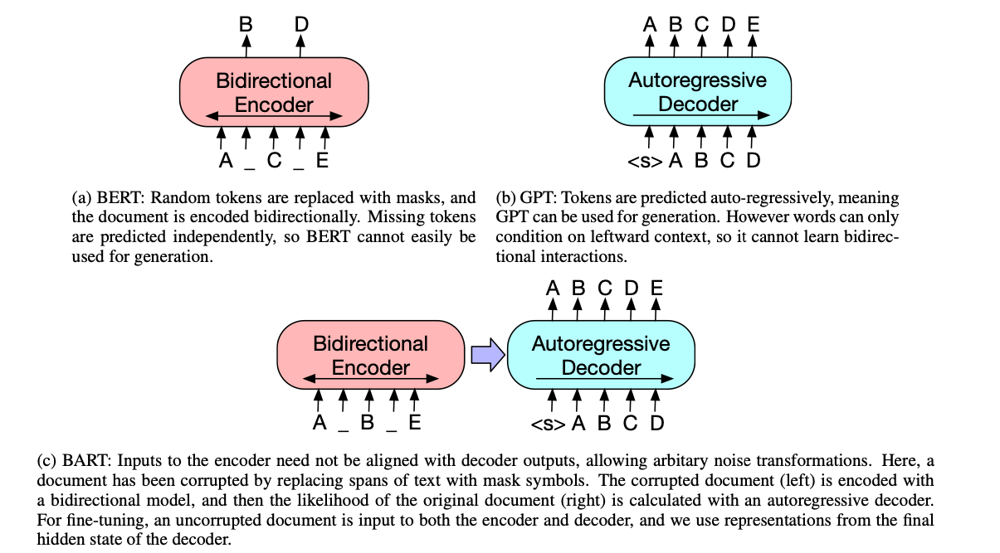
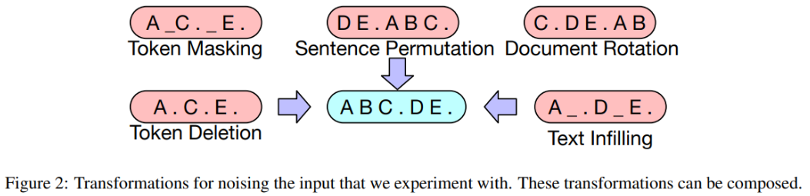
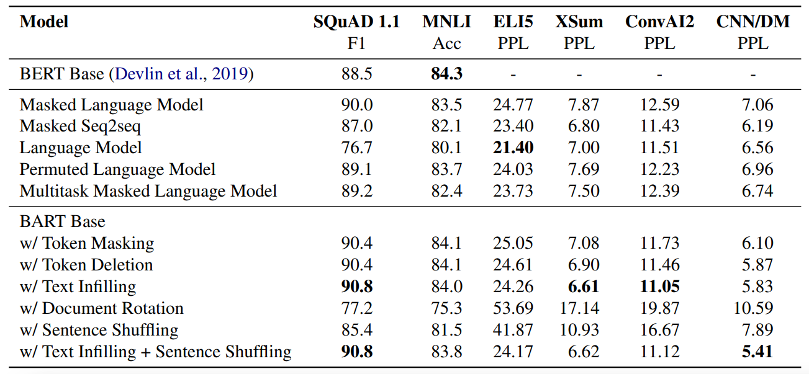

​	BART is an autoregressive seq2seq encoder-decoder transfromer model which is trained on 5 pre-training tasks, notably denoising pre-training which trains the model to reconstruct corrupted language input. They also analyze the effectiveness of the various pre-training objectives proposed in paper for different downstream tasks.

<!-- more -->

Paper：<https://arxiv.org/abs/1910.13461>

Github: <https://github.com/huggingface/transformers/blob/main/src/transformers/models/bart/modeling_bart.py>


## Introduction

BART combines Bidirectional and Auto-Regressive Transformers to create a denoising auto encoder. In essence, the authors explain it to be a custom combination of BERT [2] and GPT [4] (Figure 1). Its pretraining objective is to corrupt the input text with a noise function (arbitrarily complex) and then use a sequence to sequence model to recreate the original input text. This pretraining helps BART learn extensively and be applicable to a series of downstream tasks, thus addressing the issue of limited applicability observed in its peers. 

But noise is subjective, so how do we decide what noise to introduce? The noise function can indeed be anything but the authors of the paper find that the most effective noising approach is random shuffling of the input text and novel in-filling where certain spans of the text sentence are masked using a single mask token. This forces the model to make long range transformations over the input - effectively learning more about the input as well.

|  | 
|:--:| 
| *Figure 1: A schematic comparison of BART with BERT and GPT (from the paper)* |

### Architecture

BART relies on the original seq2seq Transformer architecture introduced in [8]. This implies that the model has an encoder-decoder architecture with 6 encoder blocks and 6 decoder blocks. The embedding dimension is 512 and 8 attention heads are used. The only observed differences are that instead of using ReLU as activation, BART uses GeLU and parameters are initialised from N (0, 0.02). 

The authors compare BART to BERT as well - having stated that BART effectively combines BERT and GPT - and the major difference in architecture lies in that in BART - 
1. each decoder layer has an additional cross attention module over the final hidden layer of the encoder.
2. there is no additional feed-forward network before word prediction, unlike BERT.

Overall, BART has 10% more parameters than a comparably sized BERT, which adds to our understanding that it has a higher capacity to learn.

### Pre-training tasks

Talk about pre-training tasks, loss functions etc.

Now that we know what the model architecture looks like, the next area of focus is how was the model pre-trained to make it so flexible and versatile? 

As discussed before, the model is pretrained by introducing noise in the input and then learning to reconstruct the original input from the noisy input. In terms of loss, this looks like cross entropy loss between the decoder's output and the original input text. BART's novelty lies in its ability to tolerate multiple noising techniques. But what happens is the noise completely changes the input? In case where all information about the original input is lost, BART is designed to work like a language model!

The paper experiments with several transformations, all of which are listed below - 

#### 1. Token Masking
This is identical to the masking done in BERT, where random tokens are replaced with a mask element. The goal then is to predict the masked tokens.

#### 2. Token Deletion
Here the input is altered by deleting certain tokens from the input. The model is then tasked with detecting which positions were deleted off.

#### 3. Text Infilling
This technique is particularly interesting. Here, various spans of the input text (sampled from Poisson Distribution) are replaced by a *single* mask token and the model is tasked with predicting how many tokens are missing from the span.

#### 4. Sentence Permutation
The input sentences (separated on the basis of a delimiter like full stop) from the input document are randomly shuffled.

#### 5. Document Rotation
In this technique, a token is chosen from the input document at random and then the document is rotated around this token - which means the token is now the first token in the document. The training objective of the model is to determine the original starting token.

All of these techniques have been visualised in Figure 2.

|  | 
|:--:| 
| *Figure 2: Various noising techniques (from the paper)* |

## BART Experiments

### Machine Translation Fine-tuning
The authors explore using BART to improve machine translation to English. They show benefits from using the entire encoder-decoder pre-trained model (compared to previous work that showed pre-trained encoders were helpful but not pre-trained language model decoders [1]) with a few additional encoder parameters learned from bitext. 

**Changes made to BART for MT fine-tuning:** 
1. Replace encoder embedding layer with new randomly initialized encoder.
2. Train model end-to-end to map foregn words to input that can be de-noised to English.
3. Use separate vocabulary for new encoder.

**Training procedure:**
The training happens in two steps, but both steps backpropogate the cross-entropy loss from the model output. 
1. For the first step, most of BART parameters are frozen and only randomly initialized source encoder parameters, positional embeddings and self-attention input projection matrix of the first encoder layer are updated.
2. All model parameters are updated for a few iterations.

**Reported results for WMT16 Romanian to English:**
The original paper fine-tunes BART in the two stage manner as mentioned above and also compares it with a vanilla transformer baseline. They also use back-translation augmented data. The reported results are shown below with fixed BART and tuned BART being the results of the first and second fine-tuning stage respectively. They also reported that initial experiments without the back-translation data led to overfitting, which motivates additional research into regularization techniques.

**Additional Experiments**
We do some additional experiments with BART and MBART [9] to analyze their machine-translation performance. We do zero-shot inference with MBART-large-50 (```facebook/mbart-large-50-many-to-many-mmt```) a checkpoint which has been trained on 50 languages for machine translation. We also do some fine-tuning experiments with BART-base (`facebook/bart-base`) and BART-large (`facebook/bart-large`). The MBART model performs very well in a zero-shot setting, almost outperforming the baseline and Fixed-BART. However the fine-tuned BART models don't perform as well. We theorize this is because we don't do the 2-stage fine-tuning described in the paper and we don't use the backtranslated WMT16 Romanian-to-English data and instead use the regular dataset (https://huggingface.co/datasets/wmt16/viewer/ro-en). Additionally the models might be slightly under-trained due to limited computational resources. 

| Model 	| RO-EN (BLEU) 	|
|---	|---	|
| Transformer Baseline 	| 36.8 	|
| Fixed BART 	| 36.29 	|
| Tuned BART 	| **37.96** 	|\
| MBART-large-50 zeroshot* 	| 36.77	|
| BART-base zeroshot* 	| 3.47 	|
| BART-large zeroshot* 	|  3.29	|
| BART-base* 	| 26.04 	|
| BART-large* 	| 29.60 	|

<model>* represent additional experiments

### Case Study:
We present a few case examples for the additional experiments we performed with MBART and BART. 

#### **mBART**

mBART performs very well as is shown by the BLEU score but the following examples highlight its abilities - 

1. In the following example we see that the model is able to connect the terms "holding back" and "reluctance".
   ##### Original - Experts believe November's Black Friday could be holding back spending.
   ##### Translated -  Experts believe that November's Black Friday could lead to spending reluctance.

2. A failure case can also be observed, where although the original sentence was talking about people being injured due to a crane crash, the translated sentence talks about a "Falling Macaral" which does not make much sense.
   ##### Original - The Health Ministry said a total of 394 people were also injured after the crane crashed down.
   ##### Translated -  Health Minister Says A Total of 394 People Injured in Falling Macaral

#### **BART**
We analyze some failure and success cases of our fine-tuned BART as well. 

1. While it doesn't do well on BLEU score, there are potentially false positives like the example below, where the translation has "Secretary-General" but the reference has "Chief". "Secretary-General" is the same as the UN Chief, but BLEU as a metric doesn't consider their equivalence:
    ##### Original - UN Chief Says There Is No Military Solution in Syria.
    ##### Translated - The UN Secretary-General states that there are no military solutions in Syria.
2. A tricky failure case is shown here. The reference uses the pronoun "He" but the translation contains "The Ban". The Romanian text also contains the term "Ban" but the reference implies it needs to be translated as the pronoun "he". 
    ##### Original - He expressed regret that divisions in the council and among the Syrian people and regional powers "made this situation unsolvable."
    ##### Translated - The Ban expressed his regret that divisions in the Council and between the Syrian people and regional powers 'made this situation untenable'.

### Comparing Effectiveness of Pre-training Objectives
The BART model uses the following five transformations for pre-training: <br>
**1. Token Masking:** Random tokens sampled and replaced with `[MASK]` tokens, inspired by BERT [2]. <br>
**2. Token Deletion:** Random tokens deleted from input <br>
**3. Text Infilling:** Text spans sampled from Poisson distribution (λ = 3) and replaced with `[MASK]`, inspired by SpanBERT [3]. <br>
**4. Sentence Permutation:** Sentences as divided by full stops are shuffled in a random order. <br>
**5. Document Rotation:** Token is chosen uniformly at random and document is rotated to begin with it.

They experiment with de-noising training with different comnbinations of pre-training objectives.

**Other baselines:** To facilitate a fair comparison between de-noising pre-training and other forms of pre-training they set up other baselines as follows:

**1. Language Model:** Trained left-to-right like GPT [4]. Equivalent to BART decoder without cross-attention. <br>
**2. Permuted Language Model:** Based in XLNet [5]. 1/6 tokens are sampled and generated in a random order autoregresively. <br>
**3. Masked Language Model:** Follows BERT [2], where 15% of tokens are replaced with `[MASK]` tokens. <br>
**4. Multitask Masked Language Model:** Similar ot UniLM [6], trained with MLM with additional self-attention masks. Self attention masks are chosen randomly with 1/6 left-to-right, 1/6 right-to-left, 1/3 unmasked, 1/3 with first 50% of tokens unmasked and left-to-right mask for remaining. <br>
**5. Masked Seq-to-Seq:** Similar to MASS [7], mask a span containing 50% of tokens and train seq-to-seq model to predict masked tokens.

**The results below show that:**

1. Choice of pre-training tasks highly affects the performance for different downstream tasks.
2. Token masking is crucial. Token delection or masking needs to be mixed up with tasks like rotating documents or permuting sentences.
3. Left-to-right pre-training is important for generation tasks.
4. Pre-training objectives need to combined with other improvements. For e.g. the permuted language model baselines is worse than XLNet because it doesn't have relative-position embeddings and segment level recurrence.
5. BART with Text-infilling performs well over most tasks (except ELI5).

<!-- ## Further Reading and Interesting Results -->
<!-- Th -->

<!-- ## Challenges in machine translation pre-training
At present, the vast majority of AI tasks are basically statistical learning based on data, and the performance of the model depends on the quality and quantity of data to a large extent. It has become a new successful paradigm for NLP to use a large amount of cheap data to pre-train the model, then fine-tune with a small amount of annotation data in specific scenarios. For example, pre-trained on large-scale unlabeled text, BERT[2] can achieve good results on 11 NLU tasks after fine-tuning on limited annotation data. However, in multilingual machine translation, the paradigm of pre-training and fine-tuning has not yet achieved general success. The training objectives  of previous NLP pre-training methods such as BERT and GPT[5] have a large gap with machine translation, thus are not easy to use directly. mRASP proposed a new idea: it uses massive bilingual parallel corpus accumulated in multiple languages to jointly train a unified model, and then fine-tune based on it. Therefore the pre-training and fine-tuning objectives are as close as possible, so as to give greater play to the role of the pre-training model.


The above figure compares and analyzes the limitations of the previous NLP pre-training paradigms in machine translation scenarios. BERT and GPT respectively correspond to the pre-training of the Transformer[6] encoder part and the decoder part, while machine translation uses the whole sequence-to-sequence model. Only part of the parameters of the translation model are initialized due the inconsistency in model structure. Therefore it will be difficult to effectively play the role of pre-training. As a result, it requires a lot of special skills to be improved [10].

Researchers soon proposed frameworks such as MASS [7] and BART [8] to extend pre-training to sequence-to-sequence tasks. They use auto-encoder for self-learning and have achieved significant results in many downstream NLG tasks. However, there are still two important problems when applying them in machine translation: 1) They brings no improvement in rich-resource languages (such as English, German, English and French). 2) There is no way to extend to multilingual translation tasks. This limitation is largely due to the fact that autocoding is a relatively simple task so it is difficult to learn a deeper representation. By contrast, machine translation requires a more complex semantic transformation. The training objective discrepancy between pre-training and fine-tuning makes it difficult for the model to make the best use of training data. It has become an important challenge to overcome the two problems for the application of pre-training paradigms in the field of machine translation. -->

<!-- ## Motivation and Techniques of mRASP
​For language learners, a very interesting phenomenon is that after learning three or four languages, the speed of learning a new language will accelerate. For example, if an English native speaker learns German and French separately, he/she may take one year each. However, if he learns German first and then learns French, he/she may only take one year and three months to learn it. If he/she learns Spanish subsequently, the speed may be faster [3]. The same is true for learning programming languages. Learning C ++ may take one year. Learning Java, Python subsequently may only take one month. A simple explanation is that in the process of multilingual learning, human beings will spontaneously summarize the abstract commonalities among languages and focus on learning the characteristics of new languages. Therefore, in order to improve personal language learning ability, it is often necessary to learn more languages, to have a more accurate grasp of language commonalities, instead of desperately learning one language. By the same token, for machine translation, it has become a very interesting question whether the translation ability can be transferred to different languages so that the information between different languages can be utilized for each other.


The design goal of mRASP is based on such considerations: design a general pre-trained model to learn the commonalities of transformation between languages, and then it will be easier to migrate to the new translation direction. Just like language learners, after learning two languages, the third language becomes easier. The design of mRASP follows two basic principles: first, the training objective of pre-training is the same as machine translation, and it is necessary to learn the transformation ability between languages; second, learn the universal representation of the language as much as possible, if the semantics of cross-lingual sentences or words are close, the representation should also be close.

mRASP follows a common pre-training-fine-tuning framework. In the pre-training stage, unlike the traditional pre-training model in which massive unsupervised monolingual data are used, mRASP takes a different approach: it puts multilingual parallel data into the same model for joint training. The Transformer architecture is adopted, plus a language identifier (Language token) to identify the source language and the target language. In order to ensure that sentences and words in different languages could be embedded in the neighbor space, sentences with the same meaning,  random alignment substitution (RAS) is introduced to create a richer context.

There is a certain probability that "爱"(Chinese) in a Chinese sentence "我 爱 北京 天安门" will be replaced by "aime" (French), and "北京"(Chinese) will also be replaced by "Pékin" (French), so the original sentence becomes "I aime Pékin Tiananmen." A pair of parallel sentence pairs in the training set can be expanded into two pairs (even three pairs, four pairs,......)

```
我 爱 北京 天安门 ==> I love Beijing Tiananmen Square
我 aime Pékin 天安门 ==> I love Beijing Tiananmen Square
```

For the model, by learning from abundant parallel corpus, it will naturally learn the correspondence between synonyms across different languages according to this "artificially created context". In fact, RAS based on parallel dictionaries has bridge the representation gap of synonyms across different languages. In the above example, the word vector expectations calculated by "爱"('love' in Chinese) and "aime"('love' in French) are as close as possible.


In the fine-tuning stage, we initialize the parameters with mRASP, and then we adopt the same training method as the traditional single-directional machine translation. Therefore, using mRASP does not require any additional skills. For a detailed introduction, please refer to the paper[1].

## Effectiveness of mRASP
mRASP uses parallel corpus of 32 languages to-and-from English for pre-training. When we only use parallel corpus of English to French wmt14 for fine-tuning, it achieves 44.3 BLEU without laborious Back Translation of massive monolingual corpus. Moreover, when applied to a new translation direction Dutch (Nl) to Portuguese (Pt), with only 12,000 parallel sentence pairs for fine-tuning, mRASP gets a reasonable (BLEU 10 +) model in ten minutes. By contrast, training any usable MT model from scratch using the equivalent parallel sentence pairs is impossible (BLEU is close to 0).

In summary, mRASP has the following advantages:
1. Easy to reproduce

The pre-training of mRASP only requires a total of 110 million parallel sentence pairs (the same pair of parallel sentence is applicable to both directions, resulting in a total of 220 million training samples), and the vocabulary only has 64k bpe subword tokens. Compared with other pre-training methods, in which tens of billions of data and dozens of layers are frequently used, the training process is less difficult. We can complete the pre-training process on 32 languages in less than a week using 8 GPUs. By the way, support for more languages can also be simply expanded.

2. Highly Versatile

Compared with the single-directional machine translation models, mRASP brings a consistent improvement in rich, medium and low-resource scenarios. Even for English to French direction where we have the largest parallel corpus, the translation quality is further improved by 1.1 BLEU. More surprisingly, for Dutch to Portuguese direction that have never been seen in the pre-training data, a significant improvement of 10 + BLEU has also been achieved.

Here are some representative experimental results:

### 1. En-De and En-Fr Benchmarks
The following figure compares the effect of mRASP on En-De and En-Fr with several concurrent cross-lingual pre-training models. It can be seen that mRASP has certain advantages: it reaches 30.3 (tokenized BLEU) on En->De wmt 2016 test set, 44.3 (tokenized BLEU) on En->Fr wmt 2014 test set. CTNMT uses BERT pre-training. MASS introduces large-scale monolingual data. mBERT is a multilingual BERT model. mBART is another pre-training method that is proposed concurrently, it uses massive multilingual monolingual data, and is trained on 256 GPUs for 20 days.


### 2. Extend to language not seen during the pre-training phase
Directions that are not included in parallel pairs during the pre-training stage, are also referred as "Exotic Directions". Whether mRASP is effective on Exotic Directions, determines whether mRASP has good generalization capabilities.

The Exotic Directions are divided into four situations in the paper:

- Exotic Pair: Both the source language and the target language have been individually pre-trained, but the model has not yet seen the bilingual pairs of them
- Exotic Source: The model has only seen the target language in the pre-training stage, and the source language has not been seen at all
- Exotic Target: The model has only seen the source language in the pre-training stage, and the target language has not been seen at all
- Exotic Full: The model has not seen the source language or the target language at all in the pre-training stage

It is difficult to train machine translation under the circumstances. Of course, the most difficult one is the last one, which is equivalent to requiring people who have never learned Latin and Hindi to read a few sentences in Latin and Hindi then translate between them.


|  Category  | Source language seen during pre-training? | Target language seen during pre-training? | Language pair seen during pre-training? | 
| :----------:| :---: | :----: | :----:|
|  Exotic Pair  | ✔ | ✔ |  X |
|  Exotic Source  |  X | ✔ | X |
| Exotic Target  | ✔ | X | X |
|  Exotic Full  | X | X |  X|

It is worth noting that both sides of Fr-Zh have appeared separately, but they have not appeared as parallel pairs. mRASP achieves a 20 + BLEU score after fine-tuning on 20K parallel corpus.

For Exotic Full scenario, such as Dutch to Portuguese (Nl-Pt), only 12,000 parallel corpora are used, and after about 10 minutes of training, you can achieve a 10+ BLEU score.


### 3. Case study
In order to understand the effect of mRASP more intuitively, the authors also make a case study in the paper.

#### French-Chinese(Fr-Zh)

- Exotic Pair, 20k Parallel Sentence Pair
- Direct (0.7 BLEU) is much weaker than mRASP (25.8 BLEU)

The Direct system does not work at all, while the mRASP system translates well.

| | Original Text | Translation in English |
| :---: | :--- | :--- |
|  source | Ordre du jour provisoire de la 7424e séance ( privée ) du Conseil | Provisional agenda for the 7424th (closed) meeting of the Council |
| target | 安全 理事会 第 7424 次 ( 闭门 ) 会议 临时 议程 | Security Council, 7424th (closed) meeting, provisional, agenda |
| Direct | 事实上 ， 国际 货币 基金 组织 的 国际 货币 基金 组织 （ IMF ） | In fact, international, monetary, fund, organization, international, monetary, fund, organization (IMF) |
| mRASP | 安理会 第 7424 次 （ 非 公开 ） 会议 临时 议程 | Council, 7424th (closed) meeting, provisional, agenda |

#### Dutch-Portuguese (Nl-Pt)
- Exotic Full, 12,000 parallel sentence pairs
- Direct 0 BLEU vs mRASP 14.1 BLEU

We find that the translation system obtained by mRASP can not successfully translate every detail, but it can grasp the key information of the original text. For example, in the following example (1) date (2) minutes of the meeting <-> news of meeting (3) circulated <-> shared.

| | Original Text | Translation in English |
| :---: | :--- | :--- |
| source | de notulen van de vergadering van donderdag 21 september zijn rondgedeeld. | The minutes of the meeting on Thursday, 21 September have been circulated. |
| target | a acta da sessão de quinta feira , 21 de setembro de 2000 , já foi distribuída. | The minutes of the meeting on Thursday, 21 September 2000 have now been distributed. |
| Direct | Os governos, os líderes mundiais dos seus próprios. | Governments, their own world leaders. |
| mRASP | As notícias da reunião do dia 21 de Setembro foram partilhadas. | News of the September 21 meeting has been shared. |

#### English-French (En-Fr)

- We found that one of the advantages of the model trained by the mRASP method over the Direct method is that the Direct system tends to ignore meaningless words (such as articles, deixis, etc.), while the mRASP maintains the consistency of articles and deixis.

| | Text |
| :---: | :--- |
| source | An investigation is under way to find the cause of the fire . |
| target | Une enquête est en cours pour trouver la cause de cet incendie . |
| Direct | enquête est en cours pour déterminer la cause de l' incendie . |
| mRASP | Une enquête est en cours pour trouver la cause de l' incendie . |

| | Text |
| :---: | :--- |
| source | After Broadway and London , Paris is finally finding its voice . |
| target | Après Broadway et Londres , Paris trouve enfin sa voix . |
| Direct | Broadway et Londres , Paris trouve enfin sa voix . |
| mRASP | Après Broadway et Londres , Paris trouve enfin sa voix . |

#### English-Chinese (En-Zh)
| | Original Text | Translation in English |
| :---: | :--- | :--- |
| source | and for the middle class. | |
| target | 对中产阶级而言。 | For the middle class. |
| Direct | 还有中产阶级。  | And the middle class. |
| mRASP | 对中产阶级而言。  | For the middle class. |

### Findings from mRASP trained model

As a general pre-training model, where does the improvements of mRASP for downstream MT tasks come from?

The author believes that its improvements mainly comes from two aspects:
 
  1. mRASP narrows the gap between the vector representation of synonyms across different languages
  2. mRASP narrows the gap between the vector representation of synonymous sentences across different languages

The narrowing of the gap between word-level and sentence-level representations means that after learning parallel sentence pairs in a large number of languages in the pre-training stage, mRASP implicitly "mastered" the language-independent representation, which can be migrated to any language, so mRASP can generally improve the effect of downstream machine translation tasks.

#### 1. mRASP draws word-level vector representation of different language closer
RAS is introduced by making the same context shared between synonyms across different languages. Since the word vector is determined by the context, RAS further draws the representation of synonyms across different languages closer.

Up: w/o RAS, Down: w/ RAS

It can be seen that with the RAS method, the embedding distribution between different languages is drawn closer (the angle becomes smaller).


#### 2. mRASP draws sentence-level vector representation of different language closer
mRASP narrows the gap between the representation of synonyms, as well as the vector representation of semantics.

We use the encoder output vector as the representation of the sentence (L2 normalized averaged-pooled encoded output). From the TED parallel test set (filtered 15-way parallel test set, a total of 2284), we match the nearest sentence based on similarity score (cosine similarity), then calculate the Top-1 accuracy (sentence retrieval accuracy).

Figure 1: The accuracy of mRASP minus the accuracy of mBART [9]. Note that Dutch (Nl) has never appeared in the mRASP pre-training data, and the accuracy in other directions is much higher than that of mBART.

- The average accuracy of mRASP retrieval reached 76%

Figure 2: Accuracy of mRASP minus the accuracy of mRASP w/o RAS. It can be seen that RAS  has obvious benefits on languages (Nl) that did not appear in the pre-training stage.

Figure 3: After removing the language identifier (Language token) at the beginning of the sentence, the accuracy of Nl can be further improved, at a sacrifice that the accuracy of other languages is greatly reduced.


It can be seen that RAS does further draws closer the semantic vector representation, and synonymous sentences will be closely represented after mRASP.

 -->
## Summary
BART is a seq2seq encoder-decoder transformer model which has been trained using a variety of pre-training objectives including denoising-pretraining. The authors analyze a variety of comninations of pre-training objectives showing that choice of pre-training objectives greatly affects downstream task performance. The decoder trained using denoising pre-training can be beneficial for machine translation to English with clever fine-tuning that trains the encoder first for a different source language and then does minor fine-tuning for the whole seq2seq model. The base BART model can be further improved by multilingual pre-training with the denoising objective as shown by mBART [9]. Both the BART and mBART paper demonstrated contrary to prior work that end-to-end training of encoder-decoder models could benefit tasks like MT when done using a denoising objective.

## References
[1] Sergey Edunov, Alexei Baevski, and Michael Auli. Pre-trained language model representations for language generation. In Proceedings of the 2019 Conference of the North American Chapter of the Association for Computational Linguistics: Human Language Technologies, Volume 1 (Long and Short Papers), 2019.

[2] Jacob Devlin, Ming-Wei Chang, Kenton Lee, and Kristina Toutanova. BERT: Pre-training of deep bidirectional transformers for language understanding. In Proceedings of the 2019 Conference of the North American Chapter of the Association for Computational Linguistics: Human Language Technologies, Volume 1 (Long and Short Papers), pp. 4171–4186, Minneapolis, Minnesota, June 2019. Association for Computational Linguistics. doi: 10.18653/v1/N19-1423. URL https://www.aclweb.org/anthology/N19-1423.

[3] Mandar Joshi, Danqi Chen, Yinhan Liu, Daniel S Weld, Luke Zettlemoyer, and Omer Levy. Spanbert: Improving pre-training by representing and predicting spans. arXiv preprint arXiv:1907.10529, 2019.

[4] Alec Radford, Karthik Narasimhan, Tim Salimans, and Ilya Sutskever. Improving language understanding by generative pre-training. URL https://s3-us-west-2.amazonaws.com/openaiassets/researchcovers/languageunsupervised/languageunderstandingpaper.pdf, 2018.

[5] Zhilin Yang, Zihang Dai, Yiming Yang, Jaime Carbonell, Ruslan Salakhutdinov, and Quoc V Le. Xlnet: Generalized autoregressive pretraining for language understanding. arXiv preprint arXiv:1906.08237, 2019.

[6] Li Dong, Nan Yang, Wenhui Wang, Furu Wei, Xiaodong Liu, Yu Wang, Jianfeng Gao, Ming Zhou, and Hsiao-Wuen Hon. Unified language model pretraining for natural language understanding and generation. arXiv preprint arXiv:1905.03197, 2019.

[7] Li Dong, Nan Yang, Wenhui Wang, Furu Wei, Xiaodong Liu, Yu Wang, Jianfeng Gao, Ming Zhou, and Hsiao-Wuen Hon. Unified language model pretraining for natural language understanding and generation. arXiv preprint arXiv:1905.03197, 2019.

[8] Ashish Vaswani, Noam Shazeer, Niki Parmar, Jakob Uszkoreit, Llion Jones, Aidan N Gomez, Łukasz Kaiser, and Illia Polosukhin. Attention is all you need. In Advances in neural information processing systems, pp. 5998–6008, 2017.

[9] Tang, Y., C. Tran, Xian Li, Peng-Jen Chen, Naman Goyal, Vishrav Chaudhary, Jiatao Gu and Angela Fan. “Multilingual Translation with Extensible Multilingual Pretraining and Finetuning.” ArXiv abs/2008.00401 (2020)